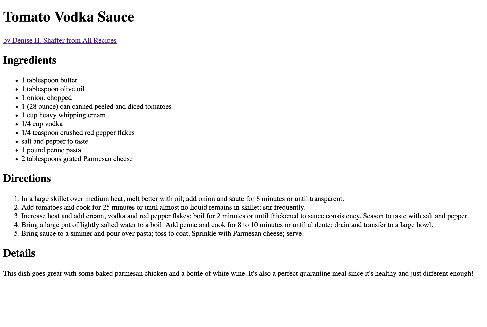

# Mini Project: Make a simple recipe page

This is a project from the HTML portion of the HTML & CSS Crash Course.

## Requirements

- Should contain a numbered list of steps
- Should have a normal list of ingredients
- The head should have a title with your dish name
- Should be a top-level heading of the dish name
- Should have an **Ingredients** heading
- Should have a **Directions** heading
- Should have a paragraph with any extra information
- Should have a link to the original recipe

## Solution

Here's an example site that meets all the requirements:

